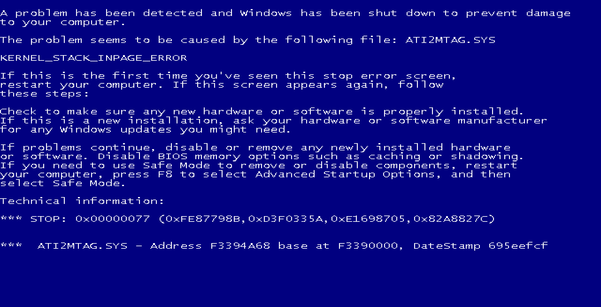

# Blue Screen of Death lock screen

This was a little program I'd written in high school to lock Windows XP
machines, back when the school's group policy didn't allow screen locking, but
fellow students have a habit of doing suspicious things when you left the
computer unattended.

The result was this Blue Screen of Death lock screen:



As you can see, it faithfully emulates the Blue Screen of Death as shown by
Windows XP, Windows Vista, and Windows 7.

Binaries can be downloaded from [Jenkins](https://ci.dmoj.ca/job/bsod/).

## Technical details

This is an ancient program, first written in ~2012, targetting Windows XP and
Windows 7. It's intended to be compiled with Microsoft's Visual C++ compiler, as
old as VC6 from 1998. Several crazy optimizations were done to ensure minimal
executable size (for no reason other than I could), such as removing the C
standard library. This means that instead of using the familiar `WinMain` entry
point:

```c
int WinMain(HINSTANCE hInstance, HINSTANCE hPrevInstance, LPSTR lpCmdLine, int nShowCmd);
```

It instead uses `RawEntryPoint`:

```c
DWORD CALLBACK RawEntryPoint(void);
```

## Building

With a Microsoft Visual C++ toolchain, simply run:

```
nmake
```

To avoid warnings with dinosaur toolchains like Visual C++ 6.0, use:

```
nmake /f Makefile.vc6
```

## Running

Simply run the resulting `bsod.exe`.

To exit, hold down <kbd>Alt</kbd> and press the following keys in sequence:
<kbd>F2</kbd>, <kbd>F4</kbd>, <kbd>F6</kbd>, <kbd>F8</kbd>, <kbd>1</kbd>,
<kbd>3</kbd>, <kbd>5</kbd>, <kbd>7</kbd>. Then, press
<kbd>Ctrl</kbd>+<kbd>Alt</kbd>+<kbd>Shift</kbd>+<kbd>Delete</kbd>.

Enter the password `quantum5.ca` to exit.
